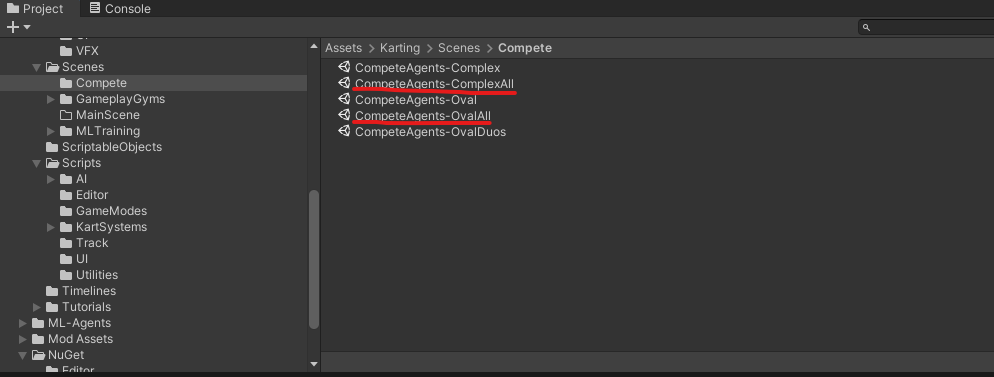
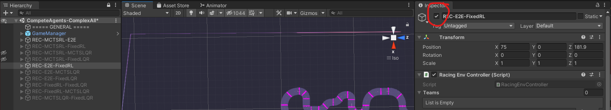
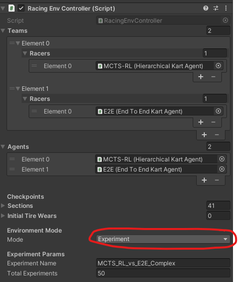
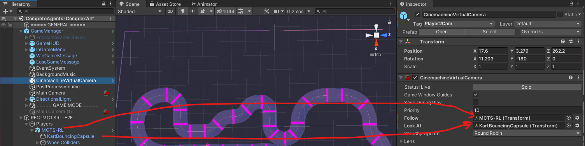
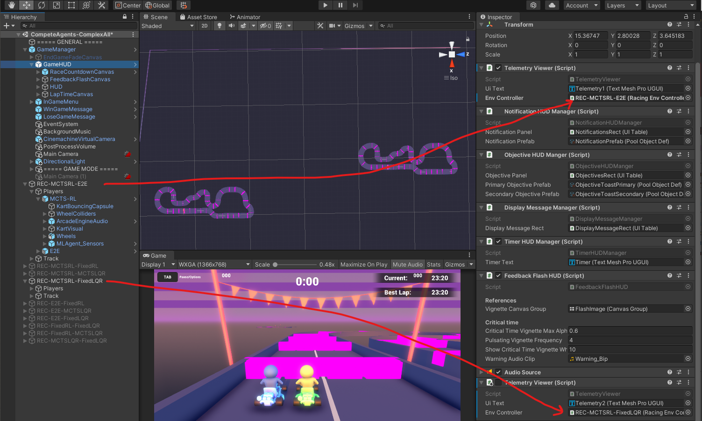

# Hierarchical Karting
Abstract - We develop a hierarchical controller for head-to-head
autonomous racing and autonomous racing amongst teams composed of cooperative agents subject to realistic safety and fairness rules. 
A high-level planner approximates the race as a
discrete game with simplified dynamics and encodes the complex safety
and fairness rules seen in real-life racing and calculates a series of
target waypoints. The low-level controller takes the resulting waypoints
as a reference trajectory and computes high-resolution control inputs by
solving a simplified formulation of a head-to-head racing game. We
consider two approaches for the low-level planner to construct two
hierarchical controllers. One approach uses multi-agent reinforcement
learning (MARL), and the other solves a linear-quadratic Nash game
(LQNG) to produce control inputs. We test the controllers against three
baselines: an end-to-end MARL controller, a MARL controller following a
fixed racing line, and a LQNG controller following a fixed racing line.
Quantitative results show that the proposed hierarchical methods
outperform their respective baseline methods. The hierarchical
controller using MARL for low-level control consistently outperformed
all other methods in head-to-head races and more consistently adhered to
the complex racing rules. Qualitatively, we observe the proposed
controllers mimicking actions performed by expert human drivers such as
shielding/blocking, overtaking, coordination amongst teammates, and long-term planning for delayed
advantages. We show that hierarchical planning for game-theoretic
reasoning produces competitive behavior even when challenged with
complex rules and constraints.

To the best of our knowledge, this is the first project to study teamwork in the context of autonomous racing. 

## Code Structure

### Complete Controller Implementation and Simulations in Unity 
Our controller implementations all reside in the
`Assets/Karting/Scripts/AI/` folder. Below are the main scripts
- `HierarchicalKartAgent.cs`: Contains implementation of the Fixed-RL,
  the MCTS-RL, Fixed-LQNG, and MCTS-LQNG agents depending on the
  selected high-level and low-level modes in the inspector panel for
  agents using this script.
- `EndToEndKartKartAgent`: Contains implementation of the E2E agent.
- `KartAgent.cs`: Base implementation of a Karting Agent that extends
  from the Agent class in the Unity ML agents platform.
- `KartMCTS.cs`: Contains an implementation of Monte Carlo tree search
  algorithm that is used to solve the discrete, high-level game. 
- `LQR/`: Contains classes used to construct and solve a Linear
  Quadratic Nash Game for one of the low-level controllers of the
  Hierarchical Agent.
- `MPC/`: Contains unused/defunct implementations of an MPC based
  low-level controller.

### High-Level Planner Study using PRISM
We also conducted a few case studies of the high-level racing game
abstraction as presented in Chapter 3 of my
[Master's Report](./THAKKAR-MASTERSREPORT-2022.pdf). We use
[PRISM-games](https://www.prismmodelchecker.org/games/) to model the
abstraction and vary some initial conditions to qualitatively verify
that the solution of the high-level game produces reasonable plans. The
code for these studies is found in the `hl_strategy/` folder with the
following files: 

- `hl_strategy_v6.py`: Generates the PRISM file for a
specific scenario given some race track parameters and vehicle
parameters 
- `command.txt`: File listing commands used execute various initial
  conditions
- `two_player_smg.prism`: Example PRISM model generated by Python script
- `two_player_smg.props`: File listing the property that is checked by
  the PRISM software

## Simulating the Agents

1. Once the project is loaded into Unity Editor, open the
   `Assets/Karting/Scenes/Compete/CompeteAgents-ComplexAll` or the
   `Assets/Karting/Scenes/Compete/CompeteAgents-OvalAll` scene to find
   pre-loaded racing environments for every pair of agents.



2. Disable/Enable the desired racing environments that include desired
   pair of agents to be tested. Note all of the MARL agents already
   refer to proper the pre-trained policies.



3. Select the environment mode in inspector panel. 
    


   1.  If the environment is set to Training mode, then the agents will
       be spawned in random locations and the hierarchical control will
       be disabled.
    
   2.  If the environment is set to Experiment Mode, the game will run a
       number of simulations and record the results in the file name
       provided in the inspector panel on the right.
    
   3.  If the environment is set to Race mode, the game will run
       simulations until play mode has ended.
     
4. Set the Cinemachine Virtual Camera GameObject Script's Follow and Look At parameters the desired Agent's game
   object and Kart.




5. Select which enabled environment's race details should appear on the
   screen by finding the TelemetryViewer Script settings in the GameHUD
   game object's inspector panel. 2 can be set at a time, but if only one environment is in use, then disable the second telemetry viewer.



6. Press play in the Unity Editor to start simulations.


## Media
#### Master's Report
Expanded discussion of the two papers below and a detailed study of the
High-Level planner model are part of my complete Master's Report
[here](./THAKKAR-MASTERSREPORT-2022.pdf)

#### Papers
Head to head racing paper on arXiv [here](https://arxiv.org/abs/2202.12861) 

Team-based racing paper on arXiv [here](https://arxiv.org/abs/2204.13070) 

#### Videos
Link to videos of some tactics executed by our hierarchical agents in
the simulations.
[Here](https://www.youtube.com/playlist?list=PLEkfZ4KJSCcG4yGWD7K5ENGXW5nBPYiF1)

The first video in the playlist supplements the head-to-head racing
paper. The second video in the playlist supplements the team-based
racing extension/paper.

## Cite Full Master's Report
```
@mastersthesis{Thakkar2022,
  author        = "Rishabh Saumil Thakkar",
  title         = "Hierarchical Game-Theoretic Control for Multi-Agent Autonomous Racing",
  school        = "The University of Texas at Austin",
  address       = "Austin, TX, USA",
  type          = "Master's Report",
  year          = "2022 [Online]",
}
```

## Cite Head-to-head racing paper
```
@misc{thakkar2022hierarchical,
      title={Hierarchical Control for Multi-Agent Autonomous Racing}, 
      author={Rishabh Saumil Thakkar and Aryaman Singh Samyal and David Fridovich-Keil and Zhe Xu and Ufuk Topcu},
      year={2022},
      eprint={2202.12861},
      archivePrefix={arXiv},
      primaryClass={cs.MA}
}
```
## Cite Team-based racing paper
```
@misc{thakkar2022hierarchical,
      title={Hierarchical Control for Cooperative Teams in Competitive Autonomous Racing}, 
      author={Rishabh Saumil Thakkar and Aryaman Singh Samyal and David Fridovich-Keil and Zhe Xu and Ufuk Topcu},
      year={2022},
      eprint={2204.13070},
      archivePrefix={arXiv},
      primaryClass={cs.MA}
}
```

